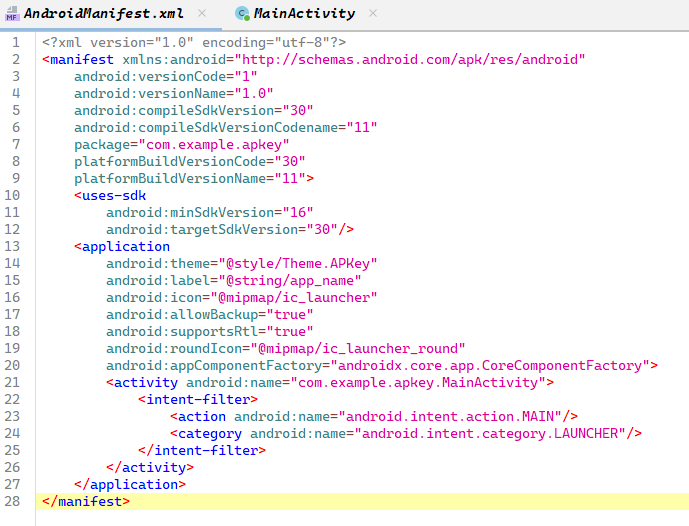
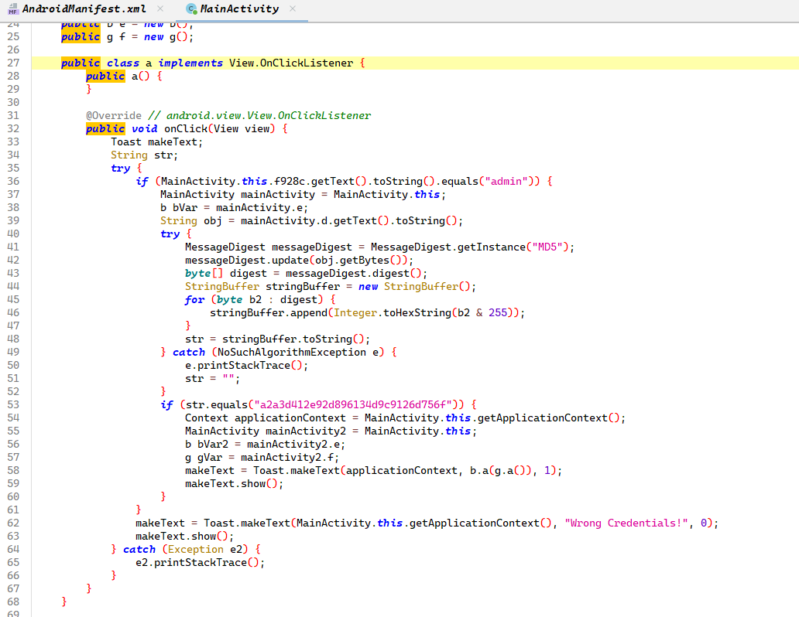
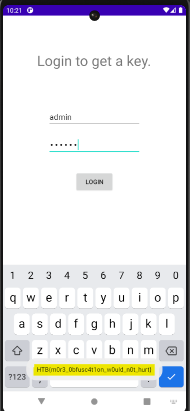

# Challenge: APKey
## Rate: Easy

Try to install the APK.

```bash
adb install APKey.apk
Performing Streamed Install
adb: failed to install APKey.apk: Failure [-124: Failed parse during installPackageLI: Targeting R+ (version 30 and above) requires the resources.arsc of installed APKs to be stored uncompressed and aligned on a 4-byte boundary]
```

The error indicates that the APK you are trying to install targets Android R (API level 30) or above, which requires the `resources.arsc` file within the APK to be stored uncompressed and aligned on a 4-byte boundary. Here's how you can fix it:

```bash
zipalign -v 4 APKey.apk aligned_APKey.apk
adb install aligned_APKey.apk
Performing Streamed Install
adb: failed to install aligned_APKey.apk: Failure [INSTALL_PARSE_FAILED_NO_CERTIFICATES: Scanning Failed.: No signature found in package of version 2 or newer for package com.example.apkey]
```

The new error indicates that the APK is not signed. Android requires all APKs to be digitally signed before installation. Here's how you can resolve the issue by signing the APK:

```bash
keytool -genkey -v -keystore my-release-key.jks -keyalg RSA -keysize 2048 -validity 10000 -alias my-key-alias
apksigner sign --ks my-release-key.jks --out signed_aligned_APKey.apk aligned_APKey.apk
apksigner verify signed_aligned_APKey.apk
adb install signed_aligned_APKey.apk
```

Now Analyze the `AndroidManifest.xml` using `Apktool` or `Jadx`.



Go to `MainActivity`:



In the `MainActivity`, the `onClick` function in the key function of this challenge which contains the login validation process. We have two conditions:

1. The username should be equal to `admin`
2. The password hash should be equal to `a2a3d412e92d896134d9c9126d756f`

From Here we have to approach to solve this challenge:

1. Frida Hooking
2. Smali Patching

## Frida Hooking

The original app checks if the MD5 hash of a user input equals `"a2a3d412e92d896134d9c9126d756f"`. When the condition is true, it proceeds with a branch that likely grants access or performs a sensitive action. We need to invert that check at runtime to effectively reverse the condition. In other words, if the hash matches, the check will now return `false`, and if it doesn’t match, the check will return `true`.

`script.js`:

```jsx
Java.perform(function() {
    // Get a reference to the java.lang.String class
    var StringClass = Java.use("java.lang.String");
    // Define the target hash string
    var targetHash = "a2a3d412e92d896134d9c9126d756f";

    // Save a reference to the original implementation of equals(Object)
    var origEquals = StringClass.equals.overload("java.lang.Object");

    // Overwrite the equals implementation
    origEquals.implementation = function(other) {
        // Check if the parameter is non-null and equals our target hash string
        if (other !== null && other.toString() === targetHash) {
            var selfValue = this.toString();
            // Determine what the original equals() would return:
            // true if 'this' is equal to targetHash, false otherwise.
            var originalResult = (selfValue === targetHash);
            // Invert the result:
            // If 'this' equals targetHash (originalResult === true), return false.
            // Otherwise, return true.
            var newResult = !originalResult;
            console.log("[Frida Hook] Intercepted String.equals(): '" +
                        selfValue + "'. Compared with '" + targetHash +
                        "'. Original result: " + originalResult +
                        " | Inverted result: " + newResult);
            return newResult;
        }
        // For all other comparisons, call the original method.
        return origEquals.call(this, other);
    };

    console.log("[Frida Hook] String.equals() hook installed.");
});
```

- `Java.perform()`
    
    ```jsx
    Java.perform(function() {
        ...
    });
    ```
    
    - This ensures that the script runs after the Android runtime is fully loaded. It provides a safe environment to interact with Java classes and methods.
- Getting a Reference to `java.lang.String`
    
    ```jsx
    var StringClass = Java.use("java.lang.String");
    ```
    
    - This gets a handle on the `java.lang.String` class so we can modify its behavior.
- Defining the Target Hash
    
    ```jsx
    var targetHash = "a2a3d412e92d896134d9c9126d756f";
    ```
    
    - The script defines the MD5 hash string that is used in the application's original comparison.
- Saving the Original `equals()` Method
    
    ```jsx
    var origEquals = StringClass.equals.overload("java.lang.Object");
    ```
    
    - This saves the original implementation of the `equals(Object)` method. The overload is specified because `equals` can be overloaded; we target the one that takes a single `Object` parameter.
- Overriding the `equals()` Method
    
    ```jsx
    origEquals.implementation = function(other) {
        if (other !== null && other.toString() === targetHash) {
            var selfValue = this.toString();
            var originalResult = (selfValue === targetHash);
            var newResult = !originalResult;
            console.log("[Frida Hook] Intercepted String.equals(): '" +
                        selfValue + "'. Compared with '" + targetHash +
                        "'. Original result: " + originalResult +
                        " | Inverted result: " + newResult);
            return newResult;
        }
        return origEquals.call(this, other);
    };
    ```
    
    - Hook Condition:
        
        The hook checks if the object (`other`) being compared is not `null` and if its string representation equals the target hash.
        
    - Capturing `this.toString()`:
        
        It converts the current string (`this`) to a regular string (`selfValue`) to perform a comparison.
        
    - Determining the Original Result:
        
        It checks whether `selfValue` is equal to the target hash (what the original method would have returned).
        
    - Inverting the Result:
        
        The script inverts the original boolean result:
        
        - If `selfValue` **is equal** to the target hash (`originalResult` is `true`), then `newResult` becomes `false`.
        - If `selfValue` **is not equal** to the target hash (`originalResult` is `false`), then `newResult` becomes `true`.
    - Logging:
        
        It logs the details of the hook execution to help with debugging.
        
    - Return Value:
        
        The method returns the inverted result instead of the original one.
        
    - Fallback:
        
        If the `equals` method is called with an argument that doesn’t match the target hash, it simply calls the original `equals()` implementation.
        
- Logging Hook Installation
    
    ```jsx
    console.log("[Frida Hook] String.equals() hook installed.");
    ```
    
    - A message is logged to confirm that the hook has been successfully set up.

Run the Frida script:

```bash
frida -U -f com.example.apkey -l .\script.js
```

Enter `admin` as a username with any password you want:



## Smali Patching

```bash
apktool d signed_aligned_APKey.apk
```

go to `MainActivity$a.smali`:

```java
...

    :goto_1
    const-string v1, "a2a3d412e92d896134d9c9126d756f"

    .line 2
    invoke-virtual {p1, v1}, Ljava/lang/String;->equals(Ljava/lang/Object;)Z

    move-result p1

    if-eqz p1, :cond_1

    iget-object p1, p0, Lcom/example/apkey/MainActivity$a;->b:Lcom/example/apkey/MainActivity;
    
...
```

Change `if-eqz` to `if-nez`.

Build, Sign, and install the APK again:

```bash
apktool b signed_aligned_APKey -o modified_signed_aligned_APKey.apk
zipalign -p 4 modified_signed_aligned_APKey.apk modified_signed_aligned_APKey1.apk
apksigner sign --ks a.keystore modified_signed_aligned_APKey1.apk
adb uninstall com.example.apkey
adb install signed_aligned_APKey.apk
```

Enter `admin` as a username with any password you want:


