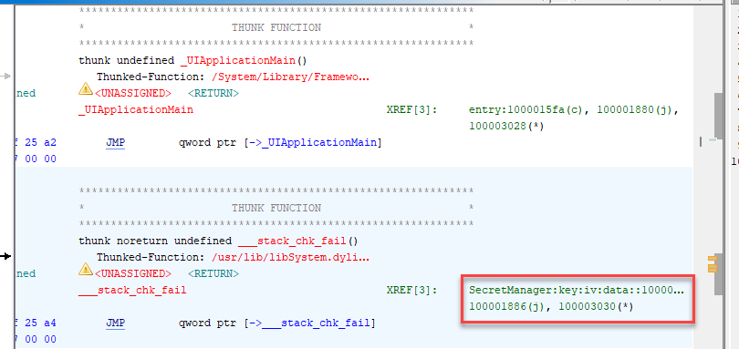
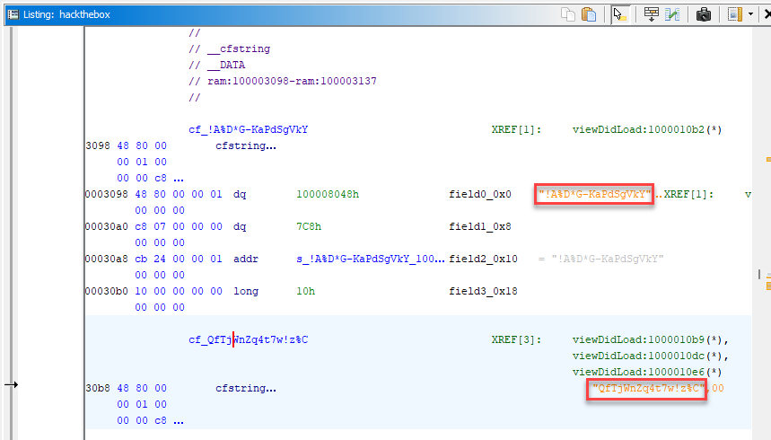

# Challenge: Cryptohorrific
## Rate: Medium

Unzip the `Cryptohorrific.zip`:

```bash
➜  hackthebox.app tree
.
├── Base.lproj
│   ├── LaunchScreen.storyboardc
│   │   ├── 01J-lp-oVM-view-Ze5-6b-2t3.nib
│   │   ├── Info.plist
│   │   └── UIViewController-01J-lp-oVM.nib
│   └── Main.storyboardc
│       ├── BYZ-38-t0r-view-8bC-Xf-vdC.nib
│       ├── Info.plist
│       └── UIViewController-BYZ-38-t0r.nib
├── Info.plist
├── PkgInfo
├── _CodeSignature
│   └── CodeResources
├── challenge.plist
├── hackthebox
└── htb-company.png
```

Here we have `challenge.plist` file. A `.plist` (property list) file is a file format used by macOS, iOS, and other Apple operating systems to store serialized objects in a structured way, typically as key-value pairs.

Since `.plist` file is not readable for us, we have to convert it to XML format:

```bash
plistutil -i challenge.plist
```

Output:

```xml
<?xml version="1.0" encoding="UTF-8"?>
<!DOCTYPE plist PUBLIC "-//Apple//DTD PLIST 1.0//EN" "http://www.apple.com/DTDs/PropertyList-1.0.dtd">
<plist version="1.0">
<array>
        <dict>
                <key>flag</key>
                <string>Tq+CWzQS0wYzs2rJ+GNrPLP6qekDbwze6fIeRRwBK2WXHOhba7WR2OGNUFKoAvyW7njTCMlQzlwIRdJvaP2iYQ==</string>
                <key>id</key>
                <string>123</string>
                <key>title</key>
                <string>HackTheBoxIsCool</string>
        </dict>
</array>
</plist>
```

The flag is encrypted.

Also we have an executable file named `hackthebox`. Let’s analyze this file with `Ghidra`.



After examining the executable we found `SecretManager:key:iv:data` which is interesting thing. Let’s look further. 



As you can see we found `Key` and `IV` values. So we can decrypt the flag using `CipherText` and `Key`.

You can use https://www.devglan.com/online-tools/aes-encryption-decryption to achieve the flag or use this python code:

```python
from Crypto.Cipher import AES
from Crypto.Util.Padding import unpad
import base64

# AES decryption function
def aes_decrypt(ciphertext_base64, secret_key):
    # Decode the Base64 encoded ciphertext
    ciphertext = base64.b64decode(ciphertext_base64)
    
    # Initialize AES cipher in ECB mode
    cipher = AES.new(secret_key.encode('utf-8'), AES.MODE_ECB)
    
    # Decrypt and remove padding
    decrypted_text = unpad(cipher.decrypt(ciphertext), AES.block_size)
    return decrypted_text.decode('utf-8')

# Inputs
ciphertext = "Tq+CWzQS0wYzs2rJ+GNrPLP6qekDbwze6fIeRRwBK2WXHOhba7WR2OGNUFKoAvyW7njTCMlQzlwIRdJvaP2iYQ=="
secret_key = "!A%D*G-KaPdSgVkY"

# Decrypt and print the result
try:
    decrypted_text = aes_decrypt(ciphertext, secret_key)
    print("Decrypted text:", decrypted_text)
except Exception as e:
    print("An error occurred during decryption:", str(e))

```

**Flag**:

```
Decrypted text: HTB
```
