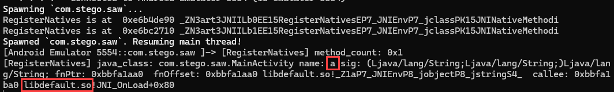

# Challenge: SAW
## Rate: Medium

Install the APK. when we click the app icon, the app won’t run. So in this situation, we have to analyze the using `Jadx`:

As usual, when examining an APK, we go straight to `MainActivity` without wasting time.


Here we have `getIntent().getExtras()` that is used to get values from intent that are stored in bundle. So we have this condition that If we don't provide `open` parameter with a value of `sesame` to the app, the app will immediately close. 

To fix this problem we can use `am` (activity manager):

```bash
am start -n com.stego.saw/.MainActivity -e open sesame
```

App:


Now if we click on the “Click me…” button, the app will immediately close again. Let’s examine the rest of the code to find the problem.


Check the APP log:


Also, look at the `AndroidManifest.xml`:


So our problem is the app doesn’t have `Allow display over other apps` permission. 

To Grant this permission to the app we have to ways:

1. `Settings > App & notifications > Advanced > Special app access > Display over other apps`
2. Running this command:
    
    ```bash
    appops set com.stego.saw SYSTEM_ALERT_WINDOW allow
    ```
    

After that, the app will open without any issues:


So let’s examine the related code:


Here’s we have function which wait’s for user input.


Also, the app has native method named `a()`. 

Although the code tell the library loaded is named `default.so`, we can’t find it in the app lib folder.

The JVM has two ways to find and link native methods with Java code. The first one is to call a native function in a specific way so that the JVM can find it. Another way is to use the **JNI `RegisterNatives()`** method.

RegisterNatives is the method that will register native methods with the class passed as an argument. By hooking it and printout information we can detect which native method belong to which library

[`hook_RegisterNatives.js`](https://raw.githubusercontent.com/lasting-yang/frida_hook_libart/master/hook_RegisterNatives.js):

```jsx

function find_RegisterNatives(params) {
    let symbols = Module.enumerateSymbolsSync("libart.so");
    let addrRegisterNatives = null;
    for (let i = 0; i < symbols.length; i++) {
        let symbol = symbols[i];
        
        //_ZN3art3JNI15RegisterNativesEP7_JNIEnvP7_jclassPK15JNINativeMethodi
        if (symbol.name.indexOf("art") >= 0 &&
                symbol.name.indexOf("JNI") >= 0 && 
                symbol.name.indexOf("RegisterNatives") >= 0 && 
                symbol.name.indexOf("CheckJNI") < 0) {
            addrRegisterNatives = symbol.address;
            console.log("RegisterNatives is at ", symbol.address, symbol.name);
            hook_RegisterNatives(addrRegisterNatives)
        }
    }

}

function hook_RegisterNatives(addrRegisterNatives) {

    if (addrRegisterNatives != null) {
        Interceptor.attach(addrRegisterNatives, {
            onEnter: function (args) {
                console.log("[RegisterNatives] method_count:", args[3]);
                let java_class = args[1];
                let class_name = Java.vm.tryGetEnv().getClassName(java_class);
                //console.log(class_name);

                let methods_ptr = ptr(args[2]);

                let method_count = parseInt(args[3]);
                for (let i = 0; i < method_count; i++) {
                    let name_ptr = Memory.readPointer(methods_ptr.add(i * Process.pointerSize * 3));
                    let sig_ptr = Memory.readPointer(methods_ptr.add(i * Process.pointerSize * 3 + Process.pointerSize));
                    let fnPtr_ptr = Memory.readPointer(methods_ptr.add(i * Process.pointerSize * 3 + Process.pointerSize * 2));

                    let name = Memory.readCString(name_ptr);
                    let sig = Memory.readCString(sig_ptr);
                    let symbol = DebugSymbol.fromAddress(fnPtr_ptr)
                    console.log("[RegisterNatives] java_class:", class_name, "name:", name, "sig:", sig, "fnPtr:", fnPtr_ptr,  " fnOffset:", symbol, " callee:", DebugSymbol.fromAddress(this.returnAddress));
                }
            }
        });
    }
}

setImmediate(find_RegisterNatives);
```



So let's decompile APK and analyze the `libdefault.so` file.

```bash
apktool d SAW.apk
cd SAW/lib/x86
ls
libdefault.so  libnative-lib.so
```

Open `libdefault.so` file in `Ghidra` or `IDA`.

Find the function `a()`:


`a()` calls `_Z1aP7_JNIEnvP8_1` which is being passed to `_Z17_Z1aP7_JNIEnvP8_1PKcS0_`.

Now using frida script we can find out that `a()` function takes  `_Z17_Z1aP7_JNIEnvP8_1PKcS0_` and our input from the app as parameters.

```jsx
Java.perform(function () {
  Interceptor.attach(Module.getExportByName("libdefault.so", "_Z17_Z1aP7_JNIEnvP8_1PKcS0_"), {
    onEnter: (args) => {
        console.log("\n[+] Arguments parameters: " + args[0].readUtf8String());
        console.log("[+] Arguments parameters: " + args[1].readUtf8String());
    },
    onLeave: (ret) => {
        console.log("[+] The return is: " + ret.toString());
    }
    });
});
```


Let continue the code:


Values of `m` & `I`:


So the code is doing XOR. We have `m` and `I`’s values, so we can find `a2` value.

```python
l = [0x0a, 0x0b, 0x18, 0x0f, 0x5e, 0x31, 0x0c, 0x0f]
m = [0x6c, 0x67, 0x28, 0x6E, 0x2A, 0x58, 0x62, 0x68]

text = ""
for i in range(0, len(l)):
	text += chr(l[i] ^ m[i])

print(text)
```


Now we have the Key.


So based on this code, if we enter `fl0ating`, then the app will create and write the flag in `/data/user/0/com.stego.saw/`.


