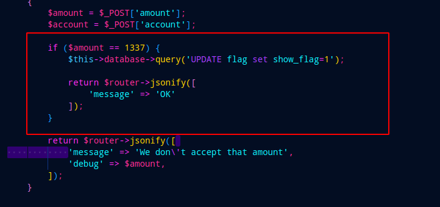
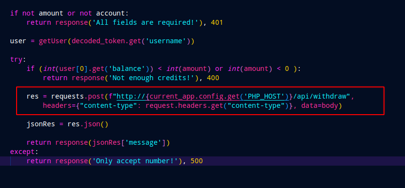
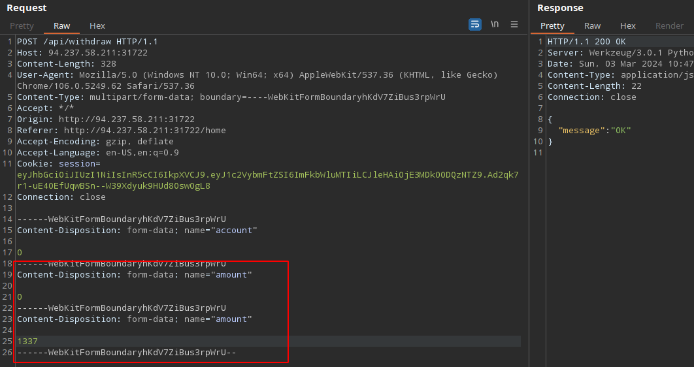
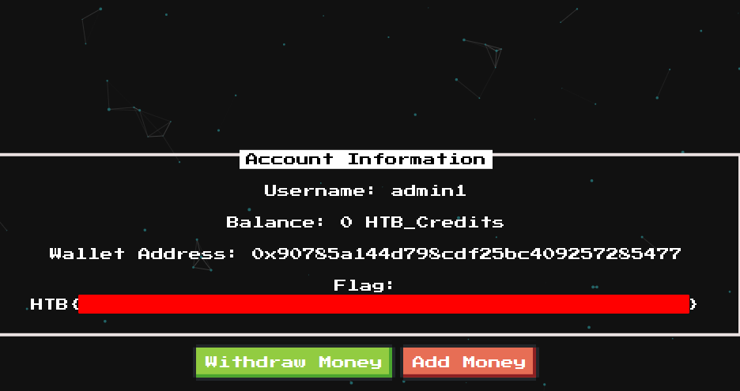

# Challange: htbank
# Rate: Easy

* We can start by downloading the source code, analysing the source code we can see that the flag is givin when we withdraw 1337 amount:
  

* The problem is when we create a new user our credit is 0 , checking the code there is a condition that checks our credit and if its true we get the response `Not enough credits`  and if is not then it sends a POST request to the PHP api endpoint.

* So this should be easy parameter pollution we need to pass 0 as the amount for passing through the condition and make it false and we can make a second parameter for the php endpoint with 1337 as the amount.

* And thats how we did pwn the HTBANK web challange.

