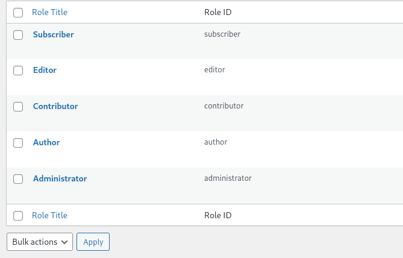

# CVE-2023-3460: Unauthorized Admin Access in Ultimate Member Plugin

| CVE ID       | CVSS Score      | Discovered   | Affected Plugin | Vendor          | Vulnerability Type        |
|--------------|-----------------|--------------|-----------------|-----------------|---------------------------|
| CVE-2023-3460|    | 07/04/2023   | Ultimate Member | Ultimate Member | Unauthorized Admin Access |

## What is Ultimate Member Plugin?

Ultimate Member is a popular WordPress plugin that provides a comprehensive set of features for user registration, login, and profile management. It is widely used by websites to create powerful user communities and membership sites. The plugin has 200,000+ active installations.

## Vulnerability Details

The vulnerability, known as `CVE-2023-3460`, exposes a security flaw in the Ultimate Member plugin for WordPress. It enables unauthorized access to administrative features of a WordPress site. The issue arises due to inadequate access control checks within the plugin. As a result, an attacker possessing a non-administrator user role can perform actions that should only be allowed for users with administrative privileges. This critical vulnerability poses a significant risk, potentially granting unauthorized users admin-level access to the widely-used Ultimate Member plugin. Website administrators must act promptly to mitigate the risk by updating the plugin to its latest version and implementing robust security measures to safeguard their WordPress sites from potential exploitation.

## Impact

The unauthorized administrative access granted by this vulnerability could lead to serious consequences, including but not limited to:

1. **Data Breach**: The attacker could gain access to sensitive user data, such as email addresses, passwords, and other personal information stored in user profiles.

2. **Site Compromise**: An attacker with administrative access could modify or delete critical site settings, posts, or pages, causing significant damage to the website's content and reputation.

3. **Malicious Actions**: The attacker might inject malicious code into the website, enabling further attacks or redirecting users to malicious sites.

## Let's Exploit

Let's explore the Roles and Capabilities of WordPress, which include various user roles such as `Super Admin`, `Administrator`, `Editor`, `Author`, and `Contributor`. Now, how can we gain admin privileges? To do that, let's first understand how the **Ultimate Member plugin** works. Initially, we need to configure the plugin properly by creating specific pages in the Pages section and then linking them to `Ultimate Member > Settings`. Once that's done, we have the option to create new roles or utilize the default roles offered by Ultimate Member.

By now, we should have a functional plugin. Now, let's delve into the backend to understand its workings. I registered a regular user with the `Subscriber` role. If we examine the `wp_usermeta` table in **MySQL**, we'll find that the `wp_capabilities` value is set to a **serialized array**, which defines our role— in this case, it's set as `Subscriber`.

To change the value of `wp_capabilities`, we can include it as a parameter in the `POST` request during the registration process, as shown below:

But it won't end there just yet. You see, there's a function named `is_metakey_banned` that operates by checking various values like `"cap_key"`, `"wp_capabilities"`, `"wp_user_level"`, `"user_activation_key"`, etc. However, our main interest lies in the `wp_capabilities`. If we include it in our request body, the function will hit the `break` statement, preventing us from changing our role.

From this point onward, we can attempt using various decoding types, but after some research and a bit of help from AI, I discovered that **WordPress accepts accent characters** like `à, è, ì, ò, ù, À, È, Ì, Ò, Ù` as default characters. Now, if we use these characters in our request body, for example, `wp_càpabilities=administrator`, what will happen? Well, it doesn't hit the **break point** on **line 182** in `class-user.php`, and this allows us to bypass the `is_metakey_banned` function.

Upon checking the **MySQL database**, we can confirm that we have successfully changed the value.

However, even though we have changed the value, it is essential to note that we are still not assigned the admin role, and in fact, we don't have any roles assigned to us at all.

Indeed, we have made some progress. However, **to become an admin**, we need to have the exact same value as the admin role, which appears like this: `a:1:{s:13:"administrator";b:1;}`. Now, let's try passing this value directly to our parameter and see if it works.

Upon re-checking the **MySQL database**, we can confirm that we did set the value of `wp_capabilities`. However, this isn't what we expected, as we are still not granted the admin role. Our attempt to directly set the `wp_capabilities` value to the admin role didn't produce the desired outcome.

It appears that our value was received and converted into a **serialized string**. However, upon examining the `wp_capabilities` of the admin role, we can observe that it is a serialized array, which is what we actually need. Thankfully, **WordPress** has its **own serialization mechanism**, so we can pass our value as an array, and **WordPress** will handle the serialization process for us. Therefore, our payload should be formatted as `wp_càpabilities[administrator]=1`. By providing it in this manner, **WordPress** will correctly interpret the array and grant us the administrator role.

Indeed, after making the necessary changes, we can observe that the value of `wp_capabilities` has been modified to `a:1:{s:13:"administrator";s:1:"1";}`. This adjustment now enables us to **log in as an admin**, granting the privileges associated with the administrator role.

Absolutely! With the `wp_capabilities` value correctly set to `a:1:{s:13:"administrator";s:1:"1";}`, we can now successfully log in as an administrator and enjoy the privileges and access granted to the admin role.

