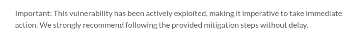
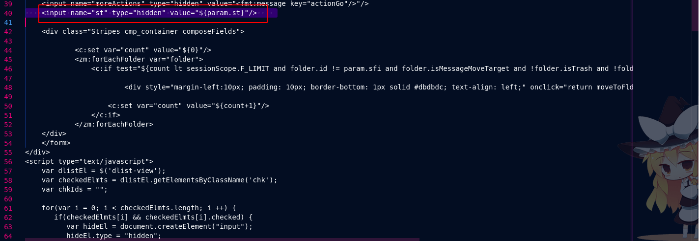
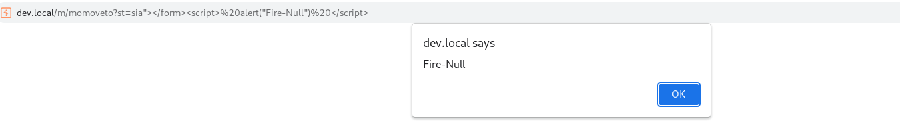

# Zimbra XSS Vulnerability Proof of Concept & Analysis

## CVSS Score: To Be Determined
## Disclosure Date: July 14, 2023

### Introduction to Zimbra
Zimbra is a robust email and collaboration suite that is comprehensive in its offerings, providing both an email server and a web client. This suite has been widely embraced due to its reliability and extensive features, currently serving over 200,000 businesses globally. Its clientele includes a notable contingent from government entities and financial sectors, underscoring its reputation and importance.

### Executive Summary
On July 14th, a severe security flaw was identified within Zimbra, classified as a cross-site scripting (XSS) vulnerability that arises from subpar input validation procedures within the software. This document aims to alert users of Zimbra that, as of the latest update, this vulnerability remains unaddressed by an official patch. It is imperative for users to follow the stop-gap measures suggested in this document to manually rectify the issue and safeguard their systems.



### Exploitation Details
A deep dive into Zimbra's source code led to an alarming discovery at `/opt/zimbra/jetty/webapps/zimbra/m/momoveto`, specifically at line 40. Here, an input parameter labeled `st` was identified that could be tampered with. An attacker, exploiting this vulnerability, would modify the normal request from `GET /h/<FILE>` to an injected form, `GET /m/momoveto?st=<PAYLOAD>`. The simplicity yet effectiveness of the payload is notable—it can be as straightforward as `<script>alert(1)</script>`. This script, when executed, springs into action within the user's session, illustrating how easily the vulnerability can be leveraged to run malicious JavaScript code.



*Let your imagination guide your exploit development.*



### Remediation Steps
To mitigate the XSS vulnerability in Zimbra, adhere to the following step-by-step instructions:

1. Create a secure backup of the vulnerable file situated at `/opt/zimbra/jetty/webapps/zimbra/m/momoveto`.
2. Open the file and navigate to the 40th line where the fault lies.
3. Amend the line by implementing the following code snippet, which employs a server-side function to escape harmful characters:
    ```html
    <input name="st" type="hidden" value="${fn:escapeXml(param.st)}"/>
    ```
   This is a crucial change as it transforms the previously exploitable input field into one that cannot be abused for executing malicious scripts.
   
### Acknowledgements
Special thanks are extended to the cybersecurity expert [@l14ck3r0x01](https://github.com/l14ck3r0x01) for identifying and devising a solution to this critical security vulnerability.
