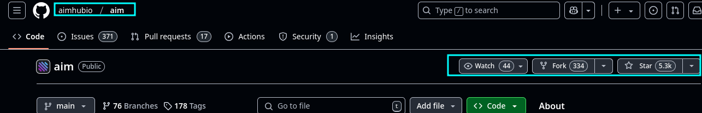
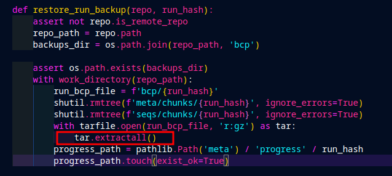
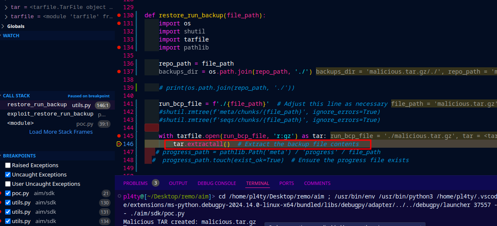
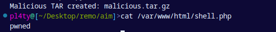

## Write-Up: Critical Arbitrary File Write Vulnerability in Aim (aimhubio/aim) - Path Traversal in restore_run_backup
### CVE-ID: N/A | Disclosure Date: Reported on Feb 5st 2025 | Researcher: spara pentest
***
# Aim: The Open-Source ML Experiment Tracking Powerhouse

Aim is a widely adopted open-source machine learning experiment tracking tool designed to help ML engineers and researchers log, compare, and visualize thousands of experiments. Trusted by organizations ranging from startups to Fortune 500 companies, Aim is critical infrastructure for teams building production-grade ML models. Its ability to restore experiment backups (bcp/ directory) ensures business continuity and reproducibility—a cornerstone of ML workflows.

This vulnerability directly threatens the integrity of Aim’s core functionality, putting ML pipelines, intellectual property, and infrastructure at risk.
***
# Vulnerability Summary
Vulnerability Summary
Severity: Critical (CVSSv3.1: 9.8)
Affected Component: restore_run_backup() in Aim’s backup restoration logic.
Root Cause: Lack of path validation during TAR archive extraction, enabling path traversal attacks.

An attacker with write access to Aim’s backup directory (bcp/) can craft a malicious .tar.gz archive to overwrite arbitrary files on the host system. This flaw allows remote code execution (RCE) in environments where Aim is deployed with elevated privileges (e.g., Kubernetes pods, CI/CD pipelines, or cloud-based ML training clusters).
***
# Technical Deep Dive
## Why This Matters
Aim’s backup restoration feature is designed to recover experiments, hyperparameters, and metadata—assets that often represent months of R&D effort. However, the absence of sanitization in `restore_run_backup()` turns this feature into a weaponizable entry point:
1. Path Traversal via tar.extractall():
    * The function uses tar.extractall() without resolving or validating the destination paths of extracted files. Attackers can embed ../ sequences in filenames to escape the bcp/ directory.
        ```python
            # Vulnerable code snippet
            with tarfile.open(run_bcp_file, 'r:gz') as tar:
                tar.extractall()  # No safe directory specified
        ```


2. Symlink Attacks:
   * Malicious archives can include symlinks pointing to sensitive locations (e.g., `/root/.ssh/authorized_keys`, `/etc/crontab`), enabling privilege escalation or persistence.
# Proof of Concept (PoC)
Step 1: Craft a Malicious Backup
```bash
# Create payload with path traversal and symlink
mkdir payload
echo "malicious_content" > payload/../../../../tmp/hacked.txt
ln -s /etc/passwd payload/../sensitive_symlink

# Package into a .tar.gz
tar -czf malicious_backup.tar.gz -C payload .
```

Step 2: Replace a Legitimate Backup
* If the attacker has write access to bcp/:
```mv malicious_backup.tar.gz /path/to/aim/repo/bcp/<legitimate_run_hash>.tar.gz```
Step 3: Trigger the Exploit
* When an administrator or automated system restores the backup:


```restore_run_backup(repo, "<legitimate_run_hash>")```
## Result:
* /tmp/hacked.txt is overwritten.
* A symlink to /etc/passwd is created, enabling further attacks.


***
# Impact
1. Remote Code Execution (RCE):
* Overwrite scripts or cron jobs (e.g., /etc/cron.daily/backup) to execute attacker-controlled code.

2. Supply Chain Compromise:
* Inject poisoned experiment data into ML models, leading to downstream integrity failures (e.g., biased predictions).

3. Data Exfiltration:
* Extract API keys, credentials, or model weights by overwriting files with sensitive data.

4. Reputation Damage:
* Loss of trust in Aim’s security posture, especially critical for enterprises in regulated industries (healthcare, finance).
***
# Mitigation
### Immediate Fix:
```python
def restore_run_backup(file_path):
    # ... existing code ...
    with tarfile.open(run_bcp_file, 'r:gz') as tar:
        for member in tar.getmembers():
            # Resolve absolute path and block traversal
            abs_dest = os.path.abspath(os.path.join(repo_path, member.name))
            if not abs_dest.startswith(os.path.abspath(repo_path) + os.sep):
                raise ValueError(f"Blocked path traversal: {member.name}")
            tar.extract(member, repo_path)
```
# Best Practices:

* Use tar.extractall(path=safe_directory) to enforce extraction within a sandboxed directory.

* Validate user-controlled input (e.g., backup filenames) using an allowlist.

* Implement digital signatures for backups to prevent tampering.
***
### Why This Matters for the ML Community
Machine learning pipelines are increasingly targeted due to their computational resources and data value. Aim’s role as a centralized experiment tracker makes it a high-value target. This vulnerability highlights the urgent need for security-by-design in ML tools, which often prioritize functionality over safeguards.

# Responsible Disclosure Timeline
* Feb 1st 2025: Vulnerability reported to Aim maintainers
* No Patch made

# References
* CodeQL Query for TAR Slip Vulnerabilities
* MITRE CWE-22: Improper Limitation of a Pathname to a Restricted Directory

# Final Note:
This write-up adheres to the principles of responsible disclosure. Always prioritize the security of open-source tools that power modern ML infrastructure
